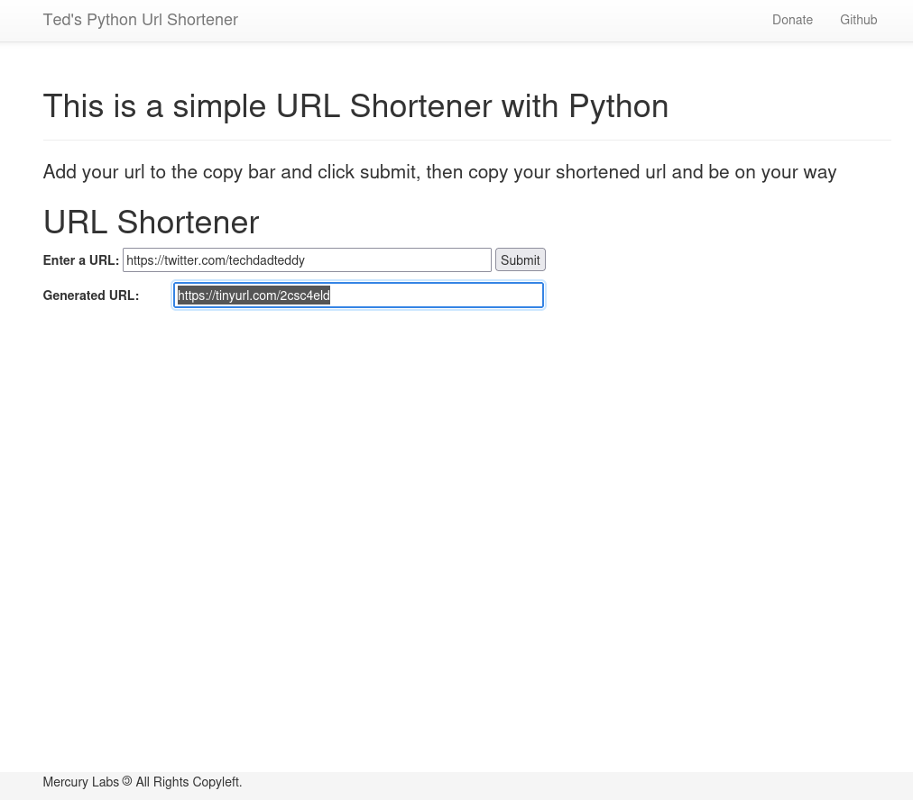

# Python-shorturl - URL Shortener With Python
 Ted's simple url shortener
 Written in Python

[Live Demo Link Coming Soon]()

### Screenshots


### Quick Docker Run
$ docker run tedleyem/python-shorturl:latest

### Quick Start

1. Clone the repo
  ```
  $ git clone https://github.com/tedleyem/flask-boilerplate.git
  $ cd folder
  ```

2. Initialize and activate a virtualenv:
  ```
  $ virtualenv --no-site-packages env
  $ source env/bin/activate
  ```

3. Install the dependencies:
  ```
  $ pip install -r requirements.txt
  ```

5. Run the development server:
  ```
  $ python app.py
  ```

6. Navigate to [http://localhost:5000](http://localhost:5000)

### Docker
 ```
 $ docker-compose up -d
 ```


### My Resources
* Built with [flask-boilerplate](https://github.com/realpython/flask-boilerplate)
* [PythonAnywhere - Help](https://www.pythonanywhere.com/help/)
* [Flask Documentation](http://flask.pocoo.org/docs/)
* [Flask Extensions](http://flask.pocoo.org/extensions/)
* [Real Python](http://www.realpythonfortheweb.com) :)

